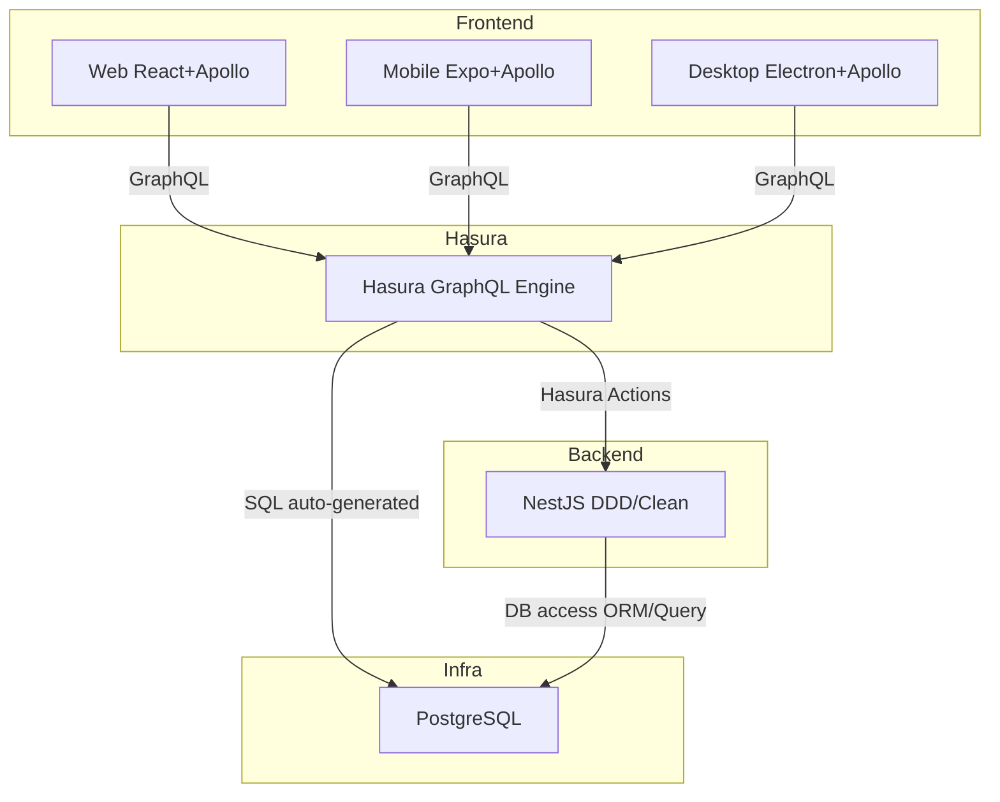

# コンテキストマップ

この図は各システム/サービスの役割とデータフローを示したコンテキストマップです。

### 説明

- **Hasura** は GraphQL Engine として、テーブルに対する CRUD を自動生成します。
- **NestJS** は Hasura Actions によるビジネスロジック（ドメインルール・ユースケース）を実装します。
- **Web / Mobile** は同一の GraphQL API を通じてメモを取得・登録します。