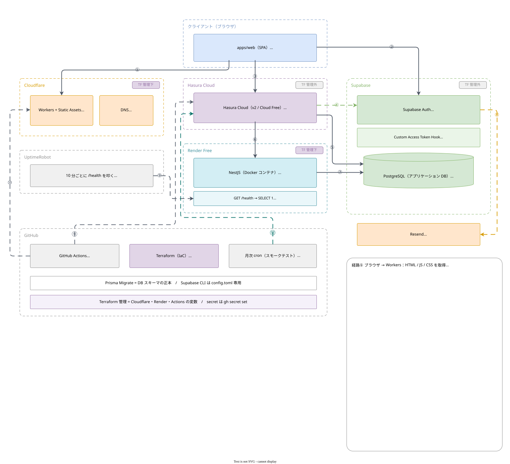
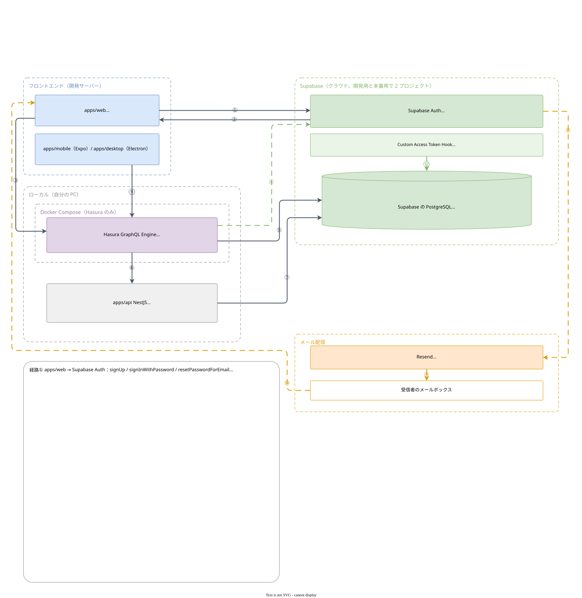

# コンテキストマップ

各システム / サービスの役割とデータフローを示します。
**認証・認可を含めた現状**の姿です。未実装の経路は図中で破線にし、対応する Issue を添えています。

## 全体図

[](./context-map.drawio.svg)

### ローカル開発時の構成

[](./context-map-local.drawio.svg)

`make dev` で立ち上がる開発環境の姿です。**本番との違いは「置き場所」だけ**になります。

| | ローカル | 本番 |
| :- | :- | :- |
| Web | Vite の開発サーバー（:5173） | Cloudflare Workers |
| Hasura | **Docker コンテナ**（:8080） | Hasura Cloud |
| NestJS | **ホストで pnpm 直起動**（:3001） | Render 上の Docker コンテナ |
| DB・認証 | Supabase（**開発用**プロジェクト） | Supabase（**本番用**プロジェクト） |

## 責務の分担

| 要素 | 責務 | 持たない責務 |
| :- | :- | :- |
| **Supabase Auth** | ユーザーの実体、パスワードのハッシュ、JWT の発行、**認証メールの送信** | アプリのドメインデータ |
| **Custom Access Token Hook** | JWT に `x-hasura-*` クレームを注入する | アプリのテーブルの参照（別インスタンスなので見えない） |
| **Resend** | Supabase から受け取ったメールの配信 | 文面の管理（Supabase の Templates で持つ） |
| **Hasura** | CRUD の自動生成、**署名の検証**、**行レベル権限**での絞り込み | ドメインロジック |
| **apps/api（NestJS）** | ドメインロジック（不変条件・ユースケース）、所有者チェック | 認証、メール送信 |
| **フロントエンド** | 画面と遷移、トークンの保持と送出 | 認可の判断（サーバー側で行う） |

## 認証情報の流れ

**鍵を配るのが Supabase、鍵を確認して部屋に通すのが Hasura**という分担です。

1. フロントが Supabase Auth にサインインし、**JWT** を受け取る
2. JWT には Hook が注入した `x-hasura-user-id` / `x-hasura-default-role` が入っている
3. フロントは Hasura に `Authorization: Bearer <JWT>` で問い合わせる
4. Hasura は **JWKS**（`https://<project-ref>.supabase.co/auth/v1/.well-known/jwks.json`）で署名を検証する
5. Hasura は `owner_id = X-Hasura-User-Id` を **SQL の `WHERE` 句**として適用する
6. 書き込みは Hasura Actions で NestJS に委譲する。**所有者は `input` ではなく `session_variables` から取る**

> [!IMPORTANT]
> **Hook が無効だと JWT に `x-hasura-user-id` が入らず、行レベル権限が全件を弾いて 0 件になります。**
> 「権限が壊れた」ように見えますが設計どおりの挙動です。確認手順は
> [project/plan/auth/manual/verify-hook.md](../project/plan/auth/manual/verify-hook.md) にあります。

## PostgreSQL は 1 つ

**ユーザーの実体とアプリのデータは同じ Supabase の PostgreSQL にあります**（#101）。
ローカル開発でも同じで、`docker-compose.yml` から `postgres` を外しました。

| スキーマ | 中身 | 所有者 |
| :- | :- | :- |
| `auth` | `auth.users`（メール・パスワードハッシュ） | **Supabase**。アプリから直接参照しない |
| `public` | `users` / `dummy` | 本プロジェクト（正本は `schema.prisma`） |

`public.users` を挟み、**`dummy.owner_id` は `users.id` への外部キー**です。
`auth.users` → `public.users` の同期は [supabase/sql/sync_auth_users.sql](../supabase/sql/sync_auth_users.sql) の
トリガーが受け持ちます（Prisma は `auth` スキーマを管理しないため）。

形式の検証は `OwnerId` 値オブジェクトが引き続き担います。DB の制約とアプリの不変条件は別物です
（[domain-model.md](./domain-model.md) / [er-diagram-notes.md](./er-diagram-notes.md)）。

> [!WARNING]
> **オフラインでは開発できません。** ローカルの PostgreSQL を廃止したためです。
> Hook が `public.users` を読む以上、アプリの DB を Docker に残すと
> **ローカルだけロールが固定**になり、権限のバグを本番でしか踏めなくなるため受け入れました。

### 接続方式の使い分け

| 用途 | 方式 | ポート |
| :- | :- | :- |
| Hasura | session pooler | 5432 |
| Prisma（実行時） | transaction pooler（`?pgbouncer=true`） | 6543 |
| Prisma（マイグレーション） | session pooler | 5432 |

**direct 接続（`db.<ref>.supabase.co`）は使いません。** IPv6 のみで、環境によっては名前解決できないためです。

## メール配信

**メールを送るのはアプリではなく Supabase です。** `apps/web` は `resetPasswordForEmail()` を呼ぶだけで、
送信処理・トークン生成・有効期限の管理はすべて Supabase の責務です。

```text
apps/web ──頼む──▶ Supabase ──SMTP──▶ Resend ──▶ 受信者
                      ▲
              接続情報はここ（supabase/config.toml + .env）
```

送信サービスは Supabase の SMTP 設定 1 箇所と DNS レコードで差し替えられ、**アプリのコードは変わりません**。
設定の正本は [supabase/config.toml](../supabase/config.toml)、選定の経緯は
[Discussion #70](https://github.com/Hitamuki/study-web-modern-stack/discussions/70) です。

しくみの解説は [project/plan/auth/explain/email.md](../project/plan/auth/explain/email.md)、
手順は [project/plan/auth/manual/resend-smtp.md](../project/plan/auth/manual/resend-smtp.md) にあります。

## 設定の正本

| 設定 | 正本 |
| :- | :- |
| Supabase の認証設定（SMTP / Hook / Redirect URL / レート上限） | [supabase/config.toml](../supabase/config.toml)（`supabase config push` で適用） |
| 認証 Hook と `auth.users` の同期トリガー | [supabase/sql/](../supabase/sql/)（`make supabase-sql` で適用） |
| テーブル定義 | [apps/api/prisma/schema.prisma](../apps/api/prisma/schema.prisma)（`make db-push`） |
| Hasura のメタデータ（テーブル・権限・Actions） | [hasura/metadata/](../hasura/) |
| 秘匿値・環境ごとの接続先 | `.env` / `apps/api/.env`（どちらも `.gitignore` 済み。枠は `.env.example`） |
| インフラ | 未定（`infra/` の Terraform は AWS 向けだったため [#99](https://github.com/Hitamuki/study-web-modern-stack/issues/99) で削除。[#100](https://github.com/Hitamuki/study-web-modern-stack/issues/100) で Cloudflare / Render / GitHub 向けに作り直す） |
