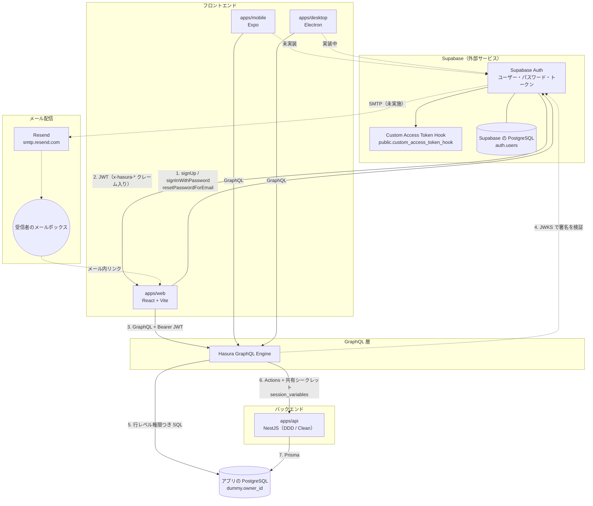

# コンテキストマップ

各システム / サービスの役割とデータフローを示します。
**認証・認可を含めた現状**の姿です。未実装の経路は図中で破線にし、対応する Issue を添えています。

## 全体図


```mermaid
flowchart TB
  subgraph SB["Supabase（外部サービス）"]
    SBA["Supabase Auth<br/>ユーザー・パスワード・トークン"]
    HOOK["Custom Access Token Hook<br/>public.custom_access_token_hook"]
    SBDB[("Supabase の PostgreSQL<br/>auth.users")]
    SBA --- SBDB
    SBA --> HOOK
  end

  subgraph MAIL["メール配信"]
    RS["Resend<br/>smtp.resend.com"]
    BOX(("受信者のメールボックス"))
  end

  subgraph FE["フロントエンド"]
    W["apps/web<br/>React + Vite"]
    M["apps/mobile<br/>Expo"]
    D["apps/desktop<br/>Electron"]
  end

  subgraph GQL["GraphQL 層"]
    H["Hasura GraphQL Engine"]
  end

  subgraph BE["バックエンド"]
    N["apps/api<br/>NestJS（DDD / Clean）"]
  end

  APPDB[("アプリの PostgreSQL<br/>dummy.owner_id")]

  W -->|"1. signUp / signInWithPassword<br/>resetPasswordForEmail"| SBA
  SBA -->|"2. JWT（x-hasura-* クレーム入り）"| W
  W -->|"3. GraphQL + Bearer JWT"| H
  H -.->|"4. JWKS で署名を検証"| SBA
  H -->|"5. 行レベル権限つき SQL"| APPDB
  H -->|"6. Actions + 共有シークレット<br/>session_variables"| N
  N -->|"7. Prisma"| APPDB

  SBA -.->|"SMTP（未実施）"| RS
  RS -.-> BOX
  BOX -.->|"メール内リンク"| W

  M -.->|"未実装"| SBA
  D -.->|"実装中"| SBA
  M -->|"GraphQL"| H
  D -->|"GraphQL"| H
```

## 責務の分担

| 要素 | 責務 | 持たない責務 |
| :- | :- | :- |
| **Supabase Auth** | ユーザーの実体、パスワードのハッシュ、JWT の発行、**認証メールの送信** | アプリのドメインデータ |
| **Custom Access Token Hook** | JWT に `x-hasura-*` クレームを注入する | アプリのテーブルの参照（別インスタンスなので見えない） |
| **Resend** | Supabase から受け取ったメールの配信 | 文面の管理（Supabase の Templates で持つ） |
| **Hasura** | CRUD の自動生成、**署名の検証**、**行レベル権限**での絞り込み | ドメインロジック |
| **apps/api（NestJS）** | ドメインロジック（不変条件・ユースケース）、所有者チェック | 認証、メール送信 |
| **フロントエンド** | 画面と遷移、トークンの保持と送出 | 認可の判断（サーバー側で行う） |

## 認証情報の流れ

**鍵を配るのが Supabase、鍵を確認して部屋に通すのが Hasura**という分担です。

1. フロントが Supabase Auth にサインインし、**JWT** を受け取る
2. JWT には Hook が注入した `x-hasura-user-id` / `x-hasura-default-role` が入っている
3. フロントは Hasura に `Authorization: Bearer <JWT>` で問い合わせる
4. Hasura は **JWKS**（`https://<project-ref>.supabase.co/auth/v1/.well-known/jwks.json`）で署名を検証する
5. Hasura は `owner_id = X-Hasura-User-Id` を **SQL の `WHERE` 句**として適用する
6. 書き込みは Hasura Actions で NestJS に委譲する。**所有者は `input` ではなく `session_variables` から取る**

> [!IMPORTANT]
> **Hook が無効だと JWT に `x-hasura-user-id` が入らず、行レベル権限が全件を弾いて 0 件になります。**
> 「権限が壊れた」ように見えますが設計どおりの挙動です。確認手順は
> [project/plan/auth/manual/verify-hook.md](../project/plan/auth/manual/verify-hook.md) にあります。

## PostgreSQL が 2 つある

**ユーザーの実体とアプリのデータは別インスタンス**にあります。

| DB | 中身 | 所有者 |
| :- | :- | :- |
| Supabase の PostgreSQL | `auth.users`（メール・パスワードハッシュ） | Supabase |
| アプリの PostgreSQL | `dummy` などのドメインテーブル | 本プロジェクト（ローカルは Docker） |

このため **`users` テーブルを作らず、外部キー制約も張っていません。**
`dummy.owner_id` は `auth.users.id`（JWT の `sub`）を指す `uuid` ですが、DB では存在確認ができません。
形式の検証は `OwnerId` 値オブジェクトが担います（[domain-model.md](./domain-model.md) / [er-diagram.md](./er-diagram.md)）。

## メール配信

**メールを送るのはアプリではなく Supabase です。** `apps/web` は `resetPasswordForEmail()` を呼ぶだけで、
送信処理・トークン生成・有効期限の管理はすべて Supabase の責務です。

```text
apps/web ──頼む──▶ Supabase ──SMTP──▶ Resend ──▶ 受信者
                      ▲
              接続情報はここ（supabase/config.toml + .env）
```

送信サービスは Supabase の SMTP 設定 1 箇所と DNS レコードで差し替えられ、**アプリのコードは変わりません**。
設定の正本は [supabase/config.toml](../supabase/config.toml)、選定の経緯は
[Discussion #70](https://github.com/Hitamuki/study-web-modern-stack/discussions/70) です。

しくみの解説は [project/plan/auth/explain/email.md](../project/plan/auth/explain/email.md)、
手順は [project/plan/auth/manual/resend-smtp.md](../project/plan/auth/manual/resend-smtp.md) にあります。

## 設定の正本

| 設定 | 正本 |
| :- | :- |
| Supabase の認証設定（SMTP / Hook / Redirect URL / レート上限） | [supabase/config.toml](../supabase/config.toml)（`supabase config push` で適用） |
| Hasura のメタデータ（テーブル・権限・Actions） | [hasura/metadata/](../hasura/) |
| 秘匿値 | `.env` / `apps/api/.env`（どちらも `.gitignore` 済み） |
| インフラ | [infra/](../infra/) の Terraform |

## 未実装・ブロック中

| 経路 | 状態 | ブロッカー |
| :- | :- | :- |
| Resend による**第三者へのメール配信** | 未実施。組み込み送信のままで、**組織メンバー以外に届かない** | [#71](https://github.com/Hitamuki/study-web-modern-stack/issues/71) → Discussion #46（サービス名 → ドメイン） |
| `apps/mobile` の認証フロー | 未実装 | [#25](https://github.com/Hitamuki/study-web-modern-stack/issues/25) |
| `apps/desktop` の認証フロー | 実装中 | [#25](https://github.com/Hitamuki/study-web-modern-stack/issues/25) |
| TLS | 未対応。ローカルは `http://localhost:8080` | [#27](https://github.com/Hitamuki/study-web-modern-stack/issues/27) |
