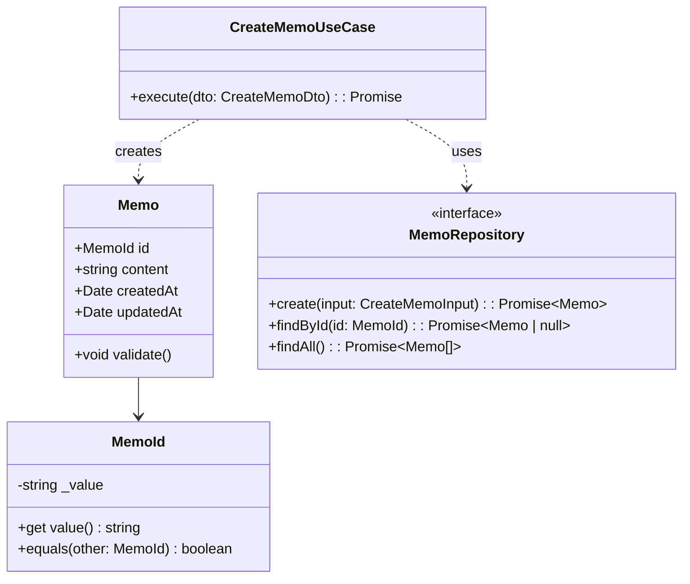

# ドメインモデル図

このドキュメントでは、メモアプリのドメインモデルを示します。

### キーコンセプト

- **Entity**: `Memo` は識別子を持つ集約ルートで、バリデーションやビジネスルールを自身で保持します。
- **Value Object**: `MemoId` は不変の識別子を表現します。
- **Repository**: ドメインからデータアクセスの詳細を切り離し、インフラ層で実装します。
- **Use Case**: `CreateMemoUseCase` がアプリケーション固有のユースケースを定義します。