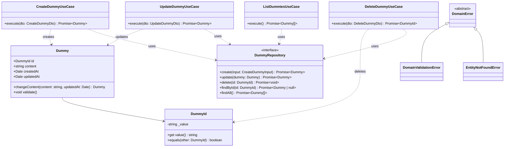

# ドメインモデル図

このドキュメントでは、SCR-005 ダミー画面が扱うドメインモデルを示します。

```mermaid
classDiagram
  class Dummy {
    +DummyId id
    +string content
    +Date createdAt
    +Date updatedAt
    +changeContent(content: string, updatedAt: Date) Dummy
    +void validate()
  }

  class DummyId {
    -string _value
    +get value() string
    +equals(other: DummyId) boolean
  }

  class DummyRepository {
    <<interface>>
    +create(input: CreateDummyInput) Promise~Dummy~
    +update(dummy: Dummy) Promise~Dummy~
    +delete(id: DummyId) Promise~void~
    +findById(id: DummyId) Promise~Dummy | null~
    +findAll() Promise~Dummy[]~
  }

  class CreateDummyUseCase {
    +execute(dto: CreateDummyDto) Promise~Dummy~
  }
  class UpdateDummyUseCase {
    +execute(dto: UpdateDummyDto) Promise~Dummy~
  }
  class DeleteDummyUseCase {
    +execute(dto: DeleteDummyDto) Promise~DummyId~
  }
  class ListDummiesUseCase {
    +execute() Promise~Dummy[]~
  }

  class DomainError {
    <<abstract>>
  }
  class DomainValidationError
  class EntityNotFoundError

  Dummy --> DummyId
  DomainError <|-- DomainValidationError
  DomainError <|-- EntityNotFoundError
  CreateDummyUseCase ..> Dummy : creates
  UpdateDummyUseCase ..> Dummy : updates
  DeleteDummyUseCase ..> DummyId : deletes
  CreateDummyUseCase ..> DummyRepository : uses
  UpdateDummyUseCase ..> DummyRepository : uses
  DeleteDummyUseCase ..> DummyRepository : uses
  ListDummiesUseCase ..> DummyRepository : uses
```

## キーコンセプト

- **Entity**: `Dummy` は識別子を持つ集約ルートで、バリデーションやビジネスルールを自身で保持します。
  本文の差し替えは `changeContent` が新しいインスタンスを返す形にし、作成日時を勝手に変えられないようにしています。
- **Value Object**: `DummyId` は不変の識別子を表現します。
- **Repository**: ドメインからデータアクセスの詳細を切り離し、インフラ層（Prisma）で実装します。
- **Use Case**: 画面の CRUD 操作に 1:1 で対応するユースケースを定義します。
- **Domain Error**: ドメイン層の例外は `DomainError` を継承させ、インフラ層のフィルターが型で HTTP ステータスへ変換します
  （`DomainValidationError` → 400、`EntityNotFoundError` → 404）。メッセージの文字列で判定しません。

## 画面との対応

参照は Hasura が自動生成する GraphQL クエリを直接使い、書き込みだけが Hasura Actions 経由で
このドメインロジックを通ります。詳細は [context-map.md](./context-map.md) を参照してください。
