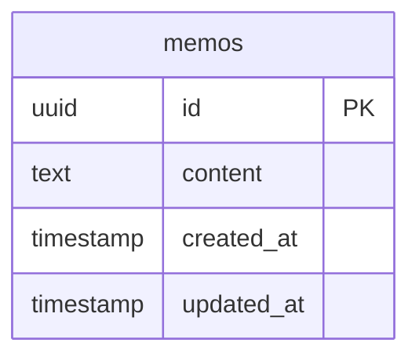

# ER図

以下はメモアプリで想定される主要テーブルとリレーションの概要です。

```mermaid
erDiagram
  memos {
    uuid id PK
    text content
    timestamp created_at
    timestamp updated_at
  }
```

### 補足

- 現時点の実装では `memos` テーブルのみを使用します。
- 将来的にユーザー情報を持たせる場合は `USER` テーブルを追加し、`memos` との関連を定義します。