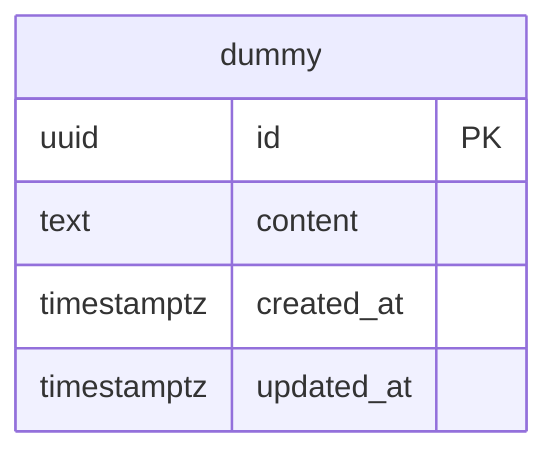

# ER図

以下は SCR-005 ダミー画面が使う主要テーブルとリレーションの概要です。

## 補足

- 現時点の実装では `dummy` テーブルのみを使用します。SCR-005 ダミー画面の検証用で、実際のドメインが固まるまでの仮置きです。
- 日時は `timestamptz` です。`timestamp` だとオフセットが付かず、クライアントがローカル時刻と誤読するためです。
- テーブル定義の正本は [apps/api/prisma/schema.prisma](../apps/api/prisma/schema.prisma) です（Hasura はメタデータのみを管理します）。
- 将来的にユーザー情報を持たせる場合は `USER` テーブルを追加し、`dummy` の後継テーブルとの関連を定義します。
