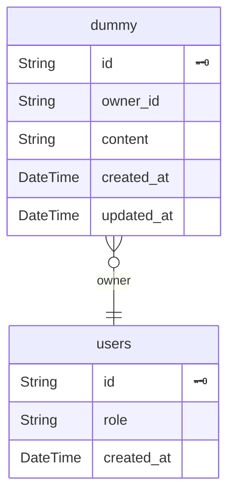

```mermaid
erDiagram

  "users" {
    String id "🗝️"
    String role 
    DateTime created_at 
    }
  

  "dummy" {
    String id "🗝️"
    String owner_id 
    String content 
    DateTime created_at 
    DateTime updated_at 
    }
  
    "dummy" }o--|| "users" : "owner"
```
