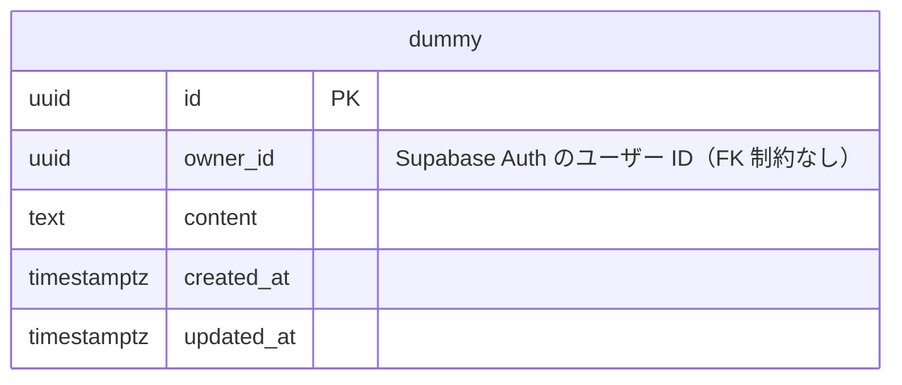

# ER図

以下は SCR-001 ダミー画面が使う主要テーブルとリレーションの概要です。

## 補足

- 現時点の実装では `dummy` テーブルのみを使用します。SCR-001 ダミー画面の検証用で、実際のドメインが固まるまでの仮置きです。
- 日時は `timestamptz` です。`timestamp` だとオフセットが付かず、クライアントがローカル時刻と誤読するためです。
- テーブル定義の正本は [apps/api/prisma/schema.prisma](../apps/api/prisma/schema.prisma) です（Hasura はメタデータのみを管理します）。

### 所有者（`owner_id`）について

- 値は **Supabase Auth のユーザー ID**（`auth.users.id`、JWT の `sub` クレーム）で、型は `uuid` です。
  認証サービスの選定経緯は [Discussion #19](https://github.com/Hitamuki/study-web-modern-stack/discussions/19) を参照してください。
- **`users` テーブルは作らず、外部キー制約も張っていません。** ユーザーの実体は Supabase 側の別 PostgreSQL にあり、
  ローカル開発では `docker-compose.yml` の PostgreSQL を使うため、DB では参照整合性を担保できないからです。
  代わりに「UUID として妥当か」の検証をドメイン層の `OwnerId` が受け持ちます。
- Hasura の行レベル権限が全クエリで `owner_id` を条件に入れるため、索引を張っています。
