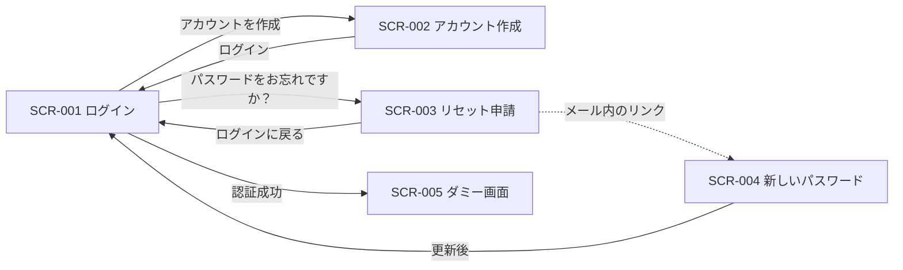

# 画面一覧

画面 ID の採番の正本です。デザイン（`design/app.pen`）と実装の対応表を兼ねます。
命名・分割の規約は [.claude/rules/design/pencil.md](../.claude/rules/design/pencil.md) を参照してください。

## 一覧

| 画面ID | 画面名 | フレーム | 関連 Issue | 実装 |
| :- | :- | :- | :- | :- |
| SCR-001 | ログイン | `SCR-001-PC` / `SCR-001-SP` | #68 / #76 / #24 | `apps/web/src/pages/login/`（ルートのみ。画面は #24） |
| SCR-002 | アカウント作成 | `SCR-002-PC` / `SCR-002-SP` | #68 / #76 / #24 | `apps/web/src/pages/signup/`（ルートのみ。画面は #24） |
| SCR-003 | パスワードリセット申請 | `SCR-003-PC` / `SCR-003-SP` | #68 / #76 / #24 | `apps/web/src/pages/password-reset/`（ルートのみ。画面は #24） |
| SCR-004 | 新しいパスワードの設定 | `SCR-004-PC` / `SCR-004-SP` | #68 / #76 / #24 | `apps/web/src/pages/password-update/`（ルートのみ。画面は #24） |
| SCR-005 | ダミー画面 | `SCR-005-PC` / `SCR-005-SP` | - | `apps/web/src/pages/dummy/` / `apps/mobile/src/pages/Dummy.tsx` / `apps/desktop/src/renderer/pages/Dummy.tsx` |

- 画面 ID は `SCR-` + 3 桁ゼロ埋めの連番。廃止しても再利用せず、欠番のまま残す。
- PC 版 / SP 版は同一画面として ID を共有し、フレーム名のサフィックスで区別する。
> [!NOTE]
> **URL との対応**（#76 で React Router v7 を導入。[Discussion #75](https://github.com/Hitamuki/study-web-modern-stack/discussions/75)）
>
> | 画面 ID | パス |
> | :- | :- |
> | SCR-001 ログイン | `/login` |
> | SCR-002 アカウント作成 | `/signup` |
> | SCR-003 パスワードリセット申請 | `/password-reset` |
> | SCR-004 新しいパスワードの設定 | `/password-update`（メールのリンクの戻り先） |
> | SCR-005 ダミー画面 | `/` |

- 書き出した画像は [screens/](./screens/) に `<画面ID>-<PC|SP>.png` で置く。`design/app.pen` の `Export`（PNG / scale 1）で生成し、
  デザインを変えたら同じ PR で書き出し直す。**ファイル名にノード ID を使わない**（ノードを作り直すと変わるため）。

> [!IMPORTANT]
> **2026-08-17 に一度だけ再採番しました。** ダミー画面が `SCR-001` を占めていましたが、
> アプリの入口はログインであり、ダミー画面は実ドメインが決まるまでの仮置きです。
> 未デプロイで外部依存が無いうちに順序を整えるため、ダミー画面を `SCR-005` へ移し、
> 認証 4 画面を `SCR-001`〜`SCR-004` に詰めました（Issue #68）。
> **以後は「廃止した ID を再利用しない」方針を維持します。** 経緯は
> [pencil.md の「再採番の履歴」](../.claude/rules/design/pencil.md)を参照してください。

## 共通コンポーネント

画面をまたいで使うコンポーネントです。`.pen` のキャンバス上部に `CMP/` 接頭辞でまとめています。

| 名前 | 用途 | 使う画面 |
| :- | :- | :- |
| `CMP/ボタン（主）` | 主要操作（ログイン / 新規作成 / 保存）。`fill` を `$danger` で上書きして削除ボタンにも使う | SCR-001〜005 |
| `CMP/入力フィールド` | ラベル + 1 行入力欄。`ラベル` と `入力テキスト` を上書きして使う | SCR-001〜004 |
| `CMP/ボタン（副）` | 副次操作（キャンセル / 編集） | SCR-005 |
| `CMP/メモ行` | 一覧の 1 行。本文抜粋・更新日時・編集/削除ボタン | SCR-005 |
| `CMP/削除確認ダイアログ` | 削除の確認 | SCR-005 |

## デザイントークン

`.pen` の変数として定義しています。画面ごとではなくドキュメント全体で共有します。

| 種別 | 変数 |
| :- | :- |
| 色 | `bg` / `surface` / `border` / `text-primary` / `text-secondary` / `accent` / `accent-text` / `danger` / `danger-bg` |
| 文字 | `font-body` |
| 数値 | `radius-md` / `gap-sm` / `gap-md` / `gap-lg` |

実装側（`apps/web/src/app/styles.css`）には `--pen-*` として 1:1 で写します。
**`danger-bg` と `gap-lg` は認証画面で追加したもので、まだ `styles.css` に写していません。**
認証画面を実装する Issue #24 で追加してください（[.claude/rules/design/pencil.md](../.claude/rules/design/pencil.md) の「実装への反映」）。

## SCR-001〜004 認証画面

Supabase Auth のメール + パスワード認証に対応する 4 画面です。
認証サービスの選定経緯は [Discussion #19](https://github.com/Hitamuki/study-web-modern-stack/discussions/19) を参照してください。

### 画面と役割

| 画面 ID | 役割 | 入力項目 | 主ボタン |
| :- | :- | :- | :- |
| SCR-001 ログイン | メールアドレスとパスワードでサインイン | メールアドレス / パスワード | ログイン |
| SCR-002 アカウント作成 | 新規登録。確認メール送信の案内まで | メールアドレス / パスワード / パスワード（確認） | アカウントを作成 |
| SCR-003 パスワードリセット申請 | 再設定リンクをメールで送る | メールアドレス | 再設定リンクを送る |
| SCR-004 新しいパスワードの設定 | メールのリンクから遷移して再設定 | 新しいパスワード / 新しいパスワード（確認） | パスワードを更新 |

> [!NOTE]
> **パスワードリセットが 2 画面に分かれているのは Supabase の復旧フローの都合です。**
> 「申請（メール送信）→ メール内のリンクで復帰 → 新しいパスワードを設定」の 2 段構成のため、1 画面では表現できません。

### 画面遷移

### レイアウト

| 版 | 構成 |
| :- | :- |
| PC（1440px） | 幅 440px のカードを画面中央に配置。カード内は縦 1 カラム |
| SP（390px） | 左右 24px の余白を取り、カードが幅いっぱいに広がる。カード内の余白は 24px |

4 画面とも同じカード構造（アプリ名 → 見出し → 説明 → 入力欄 → 主ボタン → 補助リンク）で統一しています。
入力欄は `CMP/入力フィールド` のインスタンスです。

### エラー表示

`$danger-bg` を背景、`$danger` を文字色にした帯をカード内に置き、**見出しと入力欄の間**に差し込みます。
SCR-001 のフレームは、この帯が出た状態（認証失敗時）で作ってあります。他の 3 画面は通常状態です。

エラーの出し分けは実装側（#24）の責務で、デザイン上は 1 種類の帯だけを定義しています。
入力項目ごとのインラインエラーは持たせていません。

### 書き出した画像

| 画面 | PC | SP |
| :- | :- | :- |
| SCR-001 ログイン | [SCR-001-PC.png](./screens/SCR-001-PC.png) | [SCR-001-SP.png](./screens/SCR-001-SP.png) |
| SCR-002 アカウント作成 | [SCR-002-PC.png](./screens/SCR-002-PC.png) | [SCR-002-SP.png](./screens/SCR-002-SP.png) |
| SCR-003 パスワードリセット申請 | [SCR-003-PC.png](./screens/SCR-003-PC.png) | [SCR-003-SP.png](./screens/SCR-003-SP.png) |
| SCR-004 新しいパスワードの設定 | [SCR-004-PC.png](./screens/SCR-004-PC.png) | [SCR-004-SP.png](./screens/SCR-004-SP.png) |

### 未作成の状態

| 対象 | 状態 |
| :- | :- |
| 送信中（ボタンのローディング） | 未作成 |
| SCR-002 の登録完了後（確認メール送信済みの案内） | 未作成 |
| SCR-003 の送信完了後（メール送信済みの案内） | 未作成 |
| ソーシャルログイン（Google など）のボタン | 未作成。メール + パスワードが動いてから検討する |

## SCR-005 ダミー画面

CRUD 一式を 1 画面に集約した検証用の画面です。デザイントークンとコンポーネントの当たりを取るのが目的で、
実際のアプリの画面構成を決めるものではありません。

対象ドメインは `Dummy`（[domain-model.md](./domain-model.md)）で、永続化先は `dummy` テーブル（[er-diagram.md](./er-diagram.md)）です。
フィールドは `id` / `ownerId` / `content` / `createdAt` / `updatedAt` で、タイトルを持たないため一覧は本文の冒頭と更新日時で表示します。

画面の日本語ラベル（「メモ」「メモ一覧」など）はデザインの表記をそのまま使っています。
コード側の識別子だけが `Dummy` で、これは検証用の仮テーブルであることを示すためです。

### この画面が持つ操作

| CRUD | 操作 | UI |
| :- | :- | :- |
| Create | メモの新規作成 | 本文入力欄と保存ボタン |
| Read | メモの一覧表示 | 本文の冒頭・更新日時を並べたリスト |
| Read | メモの本文表示 | 行を選択すると入力欄に読み込む |
| Update | メモの更新 | 読み込んだ本文を編集して保存 |
| Delete | メモの削除 | 各行の削除ボタン＋確認ダイアログ |

### レイアウト

| 版 | 構成 |
| :- | :- |
| PC（1440px） | 2 ペイン。左に一覧、右に作成 / 編集フォーム |
| SP（390px） | 縦 1 カラム。上にフォーム、下に一覧 |

削除確認はダイアログとして扱い、別画面として ID を振りません。

### 作成済みの内容

| 対象 | 状態 |
| :- | :- |
| `SCR-005-PC ダミー画面` | 作成済み（通常状態。メモ 4 件） |
| `SCR-005-SP ダミー画面` | 作成済み（通常状態。メモ 4 件） |
| `CMP/削除確認ダイアログ` | コンポーネントとして作成済み。画面フレームには重ねていない |
| 空状態（メモ 0 件） | 未作成 |
| 書き出した画像 | 未作成（`SCR-001`〜`004` と違い PNG を出していない） |
