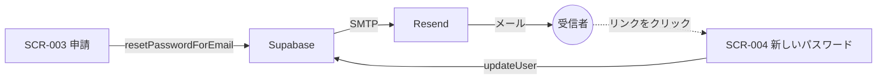

# ひとことで言うと

**アプリはメールを送りません。** 送るのは Supabase です。

私たちがやるのは「Supabase に、どの郵便局を使って出すかを教える」ことだけです。
その郵便局が **Resend** です。

# メールを送っているのは誰か

アカウント作成とパスワードリセットでは、`apps/web` が Supabase に**頼むだけ**です。

```ts
// apps/web が書くのはこれだけ。送信処理はどこにも無い
await supabase.auth.resetPasswordForEmail(email)
```

この 1 行の後ろで Supabase がやっていることは、思っているより多いです。

| Supabase がやること | なぜアプリでやらないのか |
| :- | :- |
| 復旧トークンを作る | 推測されない乱数を作り、**1 回しか使えないよう記録**する必要がある |
| 有効期限を管理する | 期限切れを判定し、古いリンクを無効にする |
| メールの文面を組み立てる | リンクにトークンを埋め込む |
| **実際に送信する** | 郵便局（SMTP サーバー）に接続する |

自分で作ると**セキュリティの要点をすべて自分で守ることになります**。
Discussion [#19](https://github.com/Hitamuki/study-web-modern-stack/discussions/19) で
「パスワードリセット・MFA の自作コストが学習の主目的から外れる」として自作を却下したのはこのためです。

## どの画面がメールを送るのか

**4 画面のうち、メールを送るのは 2 つだけ**です。ここを間違えやすいので表にします。

| 画面 | メールを送るか | 役割 |
| :- | :- | :- |
| SCR-001 ログイン | 送らない | メールとパスワードで入るだけ |
| **SCR-002 アカウント作成** | **送る** | 確認メール |
| **SCR-003 パスワードリセット申請** | **送る** | 再設定リンク |
| SCR-004 新しいパスワードの設定 | **送らない** | **メールから戻ってくる着地点** |

SCR-004 は「送る画面」ではなく「**帰ってくる画面**」です。
リセットが 2 画面に分かれているのは、間にメールが挟まるからです。



# 組み込み送信では何が困るのか

Supabase は設定なしでもメールを送れます。ただし**練習用**です。

| 制限 | 中身 |
| :- | :- |
| **宛先** | **プロジェクトの組織メンバーのアドレスにしか届かない** |
| 通数 | **2 通/時** |

つまり「自分で登録してログインを試す」ところまでは動きますが、
**自分以外のユーザーが 1 人でも増えた瞬間に破綻します。** Supabase 自身が本番用ではないと明記しています。

> [!NOTE]
> **これは「上限が低い」話ではなく「宛先が制限されている」話です。**
> 通数を気にして節約しても解決しません。他人には届きません。

# SMTP とは

**メールを送るための通信規約**です。「郵便局に荷物を持ち込む窓口の作法」にあたります。

Supabase に「この窓口を使え」と教えるのが custom SMTP の設定で、必要なのは 4 つです。

| 項目 | Resend の場合 | 例えると |
| :- | :- | :- |
| Host | `smtp.resend.com` | どの郵便局か |
| Port | `587` | どの窓口か |
| Username | `resend` | 誰として持ち込むか |
| Password | **API キー** | 本人確認の書類 |

# なぜ独自ドメインが必要なのか

**送信ドメインが無いと、Resend に乗り換えても何も変わりません。**

Resend はドメインを検証するまで `onboarding@resend.dev` からしか送れず、
**宛先も Resend アカウントの登録アドレスに限られます。** 組み込み送信と実質同じ制限です。

## なぜそんな制限があるのか

**なりすましを防ぐため**です。メールは仕組み上、送信元アドレスを自由に書けてしまいます。
そこで「このドメインのメールを送ってよいのは誰か」を DNS に書いて宣言します。

| レコード | 何を宣言するか | 例えると |
| :- | :- | :- |
| **SPF** | このドメインのメールを送ってよいサーバー | 差出人を出せる代理人のリスト |
| **DKIM** | 送信時に付ける電子署名 | 封蝋。開封・改ざんが分かる |
| **DMARC** | SPF / DKIM に失敗した場合の扱い | 不審な郵便をどうするかの指示書 |

この 3 つが揃っていないと、受信側（Gmail など）は迷惑メールに入れるか捨てます。
**「送ったのに届かない」の大半はここが原因**です。

## 乗り換えコストはサービスではなくドメインにある

Discussion [#70](https://github.com/Hitamuki/study-web-modern-stack/discussions/70) の結論はここです。

送信サービスは Supabase の SMTP 設定 1 箇所と DNS レコードで差し替えられ、**アプリのコードは変わりません**。
一方、**From のドメインを変えると積み上げた評判をゼロから積み直す**ことになります。

だから守るのはドメインで、サービスは差し替え可能に保ちます。
その方針から「Resend のテンプレート機能は使わず、文面は Supabase 側で管理する」が出てきます。

# API キーはどこに置くのか

**リポジトリ直下の `.env` に置きます。** ただし `apps/api/.env` ではありません。

Supabase の設定は [supabase/config.toml](/supabase/config.toml) で**コードとして管理**しています。
その中の SMTP 設定が、キーの値を環境変数から読みます。

```toml
[auth.email.smtp]
enabled = true
host = "smtp.resend.com"
port = 587
user = "resend"                  # 固定文字列
pass = "env(RESEND_API_KEY)"     # ← .env から読む
```

`env(...)` は「この名前の環境変数から読む」という指示です。
**キーの値そのものは config.toml に書きません。** config.toml は Git にコミットされるためです。

```text
.env（gitignore 済み）
  └ RESEND_API_KEY=re_xxxxx
       ▲ env(RESEND_API_KEY) で参照
  supabase/config.toml（コミットされる。値は入っていない）
       │ supabase config push
       ▼
  Supabase のプロジェクト設定 ──SMTP──▶ Resend ──▶ 受信者
```

## なぜ `apps/api/.env` ではないのか

**`apps/api`（NestJS）はメールを送らないから**です。読む処理がありません。

送信するのは Supabase のサーバーで、`apps/web` は `resetPasswordForEmail()` を呼ぶだけ、
`apps/api` は一切関与しません。このキーを使うのは `supabase` CLI（`config push` のとき）だけなので、
**CLI が動くリポジトリ直下の `.env`** が置き場所になります。

| ファイル | 読む主体 | Resend のキー |
| :- | :- | :- |
| `.env`（リポジトリ直下） | docker-compose / Vite / **supabase CLI** | **ここに置く** |
| `apps/api/.env` | NestJS | 置かない（読む処理が無い） |
| `supabase/config.toml` | supabase CLI | **値は置かない**（`env()` で参照するだけ） |

どちらの `.env` も `.gitignore` 済みで、実値の置き場所として正しく機能します
（[manual/env-setup.md](/project/plan/auth/manual/env-setup.md)）。
分けているのは安全性の差ではなく、**誰がその値を読むか**の違いです。

## 置き場所が変わる条件

**Send Email Hook**（Discussion #70 の H2）に切り替えると、Supabase が `apps/api` を呼び、
**NestJS が Resend の API を直接叩く**形になります。そのときは `apps/api/.env` にも
`RESEND_API_KEY` が必要になります（NestJS が読むようになるため）。

H2 は「リトライと可観測性を自作することになる」ため #70 で見送っています。
切り替えるなら決定を上書きせず、**新しい Discussion を立てます**。

# まとめ

| 問い | 答え |
| :- | :- |
| 誰がメールを送るのか | **Supabase**。アプリは頼むだけ |
| Resend の役割 | Supabase が使う**郵便局**（SMTP サーバー） |
| なぜ組み込み送信では駄目か | **組織メンバー以外に届かない**（2 通/時の上限以前の問題） |
| なぜドメインが要るのか | 無いと `onboarding@resend.dev` から**自分にしか送れない**。なりすまし対策 |
| API キーの置き場所 | **リポジトリ直下の `.env`**。`supabase/config.toml` が `env()` で参照する |
| 何をコードに書くか | アプリのコードは**何も書かない**。`supabase/config.toml` と DNS の作業 |

手順は [manual/resend-smtp.md](/project/plan/auth/manual/resend-smtp.md) にあります。
