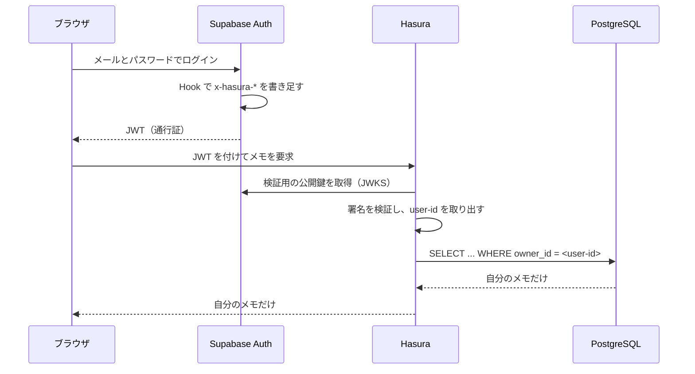
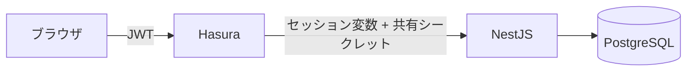

# 登場人物

| 名前 | 役割 | たとえると |
| :- | :- | :- |
| **ブラウザ** | 画面。ユーザーが操作する | 訪問者 |
| **Supabase Auth** | ログインを受け付け、通行証を発行する | 受付 |
| **Hasura** | データの出入り口。通行証を確認して絞り込む | 警備員 |
| **NestJS** | 書き込み処理の本体 | 作業員 |
| **PostgreSQL** | データの保管庫 | 倉庫 |

# JWT（通行証）とは

**署名がついた文字列**です。3 つの部分をドットでつないだ形をしています。

```
eyJhbGci...  .  eyJzdWIiOi...  .  MEUCIQD...
   ヘッダー          中身            署名
```

大事な性質が 2 つあります。

1. **中身は暗号化されていません。** 誰でも読めます（パスワードなどを入れてはいけない）
2. **署名は偽造できません。** 中身を 1 文字でも書き換えると署名が合わなくなります

つまり **「書き換えられていないことは保証されるが、隠されてはいない」**ものです。

# 全体の流れ



# Hook が書き足す情報

Supabase が既定で発行する JWT には「誰か（`sub`）」しかありません。
Hasura は**権限**も必要とするため、Hook でこれを足します。

```json
"https://hasura.io/jwt/claims": {
  "x-hasura-default-role":  "user",
  "x-hasura-allowed-roles": ["user"],
  "x-hasura-user-id":       "e9729165-..."
}
```

**この情報が無いと、Hasura は「誰だか分からない」と判断して全件を弾きます。**
設定を間違えると「0 件しか返らない」という形で現れます。

# 行レベル権限が効くしくみ

Hasura には「`user` ロールは `owner_id` が自分と一致する行だけ見てよい」と設定してあります。

```yaml
filter:
  owner_id:
    _eq: X-Hasura-User-Id    # JWT から取り出した値
```

Hasura はこれを **SQL の `WHERE` 句に変換**します。

```sql
SELECT ... FROM dummy WHERE owner_id = 'e9729165-...'
```

**ここが重要です。** 絞り込みが**データベースの問い合わせそのもの**に入るため、
アプリ側で書き忘れても他人のデータは出てきません。

# 書き込みは別の道を通る

読み取りは Hasura が直接データベースを見ますが、**書き込みは NestJS を経由します**
（業務ルールをドメイン層に置くため）。



この道には**落とし穴**があります。NestJS はデータベースに直接触るため、
**Hasura の行レベル権限を通りません。** そこで 2 つの対策を入れています。

| 対策 | 何を防ぐか |
| :- | :- |
| **共有シークレット** | NestJS を Hasura 抜きで直接叩かれること |
| **所有者チェック** | 他人のメモを更新・削除されること |

また、**所有者はブラウザからの入力ではなく Hasura が付けたセッション変数から取ります。**
入力から取ると、他人になりすましたメモを作れてしまうためです。
