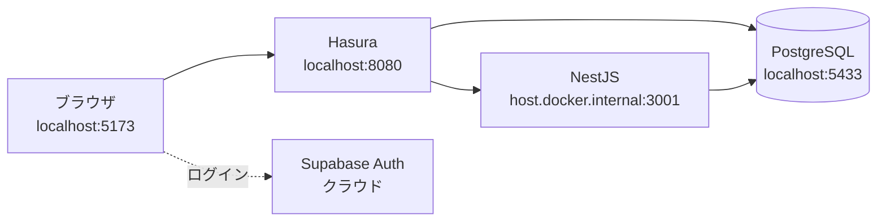
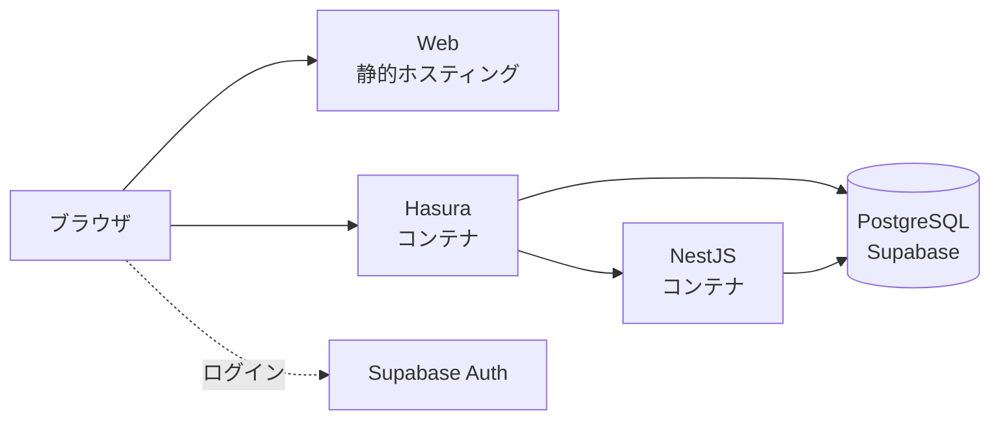

# いまの構成（ローカル）

すべてが 1 台の PC の中にあり、**`localhost` という名前でお互いを呼んでいます。**



**Supabase だけが既にクラウドにあります。** 認証（Issue #20）で導入したものです。
それ以外は全部この PC の中です。

# 公開後の構成

**同じ 4 つの要素が、別々の場所に散らばります。**



> [!NOTE]
> **どのサービスに置くかは決まっていません。** Discussion #29 で選定中です。
> ここでは「**どこに置くにせよこの形になる**」という構造だけを示しています。

# 何が変わるのか

## 1. `localhost` が使えなくなる

`localhost` は「**このコンピュータ自身**」という意味です。
別々のサーバーに散らばると、お互いを `localhost` では呼べません。

| 呼ぶ側 | 呼ぶ先 | いまの書き方 | 公開後 |
| :- | :- | :- | :- |
| ブラウザ | Hasura | `localhost:8080` | Hasura の公開 URL |
| Hasura | PostgreSQL | `postgres:5432`（Docker 内の名前） | Supabase の接続文字列 |
| Hasura | NestJS | `host.docker.internal:3001` | NestJS の公開 URL |

**`host.docker.internal` は Docker Desktop だけが理解する特別な名前**です。
クラウドには存在しないので、そのままでは Hasura が NestJS を呼べません。
→ [../layer-config.md](/project/plan/deploy/layer-config.md)

## 2. 設定を「外から」渡すことになる

ローカルでは接続先をファイルに書いておけば済みました。
公開後は**環境ごとに値が違う**ため、外から渡す形にする必要があります。

```text
ローカル:  ソースコードに書いてある値をそのまま使う
公開後:    プラットフォームが環境変数として注入した値を使う
```

Web だけ事情が違います。**ブラウザで動くコードは実行時に環境変数を読めません。**
そのため **ビルドするときに値を埋め込みます**（`VITE_` で始まる変数）。

つまり **Web は「接続先が変わったら作り直し」**です。ここが他と違う点です。

## 3. 秘密の値の置き場所が問題になる

| 値 | 性質 |
| :- | :- |
| `VITE_SUPABASE_PUBLISHABLE_KEY` | **公開してよい。** ブラウザに配る前提の値 |
| `HASURA_GRAPHQL_ADMIN_SECRET` | **秘密。** 全権限を持つ |
| `HASURA_ACTION_SECRET` | **秘密。** Hasura と NestJS だけが知っている合言葉 |
| Supabase の接続文字列 | **秘密。** データベースのパスワードを含む |

秘密の値は**リポジトリに置きません。** CI の secret か、プラットフォームの設定画面に入れます。
→ [../terraform-scope.md](/project/plan/deploy/terraform-scope.md) の「秘匿値の置き場所」

## 4. 通信が HTTPS になる

ローカルは `http://` でしたが、公開環境は `https://` になります。
**暗号化されるだけでなく、「相手が本物か」の確認も含みます。**

主要なサービスはこれを自動でやってくれるため、**この計画では自分で設定しません。**
Issue [#27](https://github.com/Hitamuki/study-web-modern-stack/issues/27) に TLS の項目がありましたが、
それは AWS 上に自分で構築する前提のもので、**AWS をやめたため close 済み**です。

# 変わらないこと

**アプリのコードのほとんどは変わりません。**

| 変わらないもの | 理由 |
| :- | :- |
| 認証のしくみ | Supabase は最初からクラウド。ローカルでも公開後でも同じ |
| Hasura の権限設定 | `hasura/metadata/` がそのまま適用される |
| ドメインロジック（NestJS） | 実行場所が変わるだけ |
| Prisma のスキーマ | 接続先が変わるだけ |

**変わるのは「どこにあるか」と「どうつなぐか」だけ**です。
だから直す対象が [../findings.md](/project/plan/deploy/findings.md) の 4 の表に収まっています。
