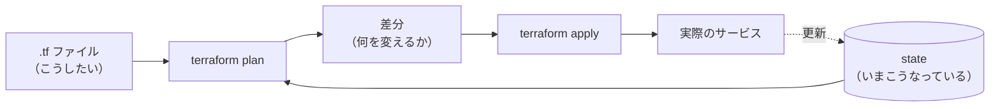

# IaC とは

**Infrastructure as Code**（コードとしてのインフラ）の略です。

**サーバーやデータベースの構成を、手作業ではなくコードで書いて管理する**やり方を指します。

```hcl
# infra/main.tf から抜粋
resource "aws_db_instance" "postgres" {
  engine         = "postgres"
  instance_class = "db.t3.micro"
  db_name        = "memoapp"
}
```

これは「PostgreSQL のデータベースを、このサイズで、この名前で用意しろ」という**注文書**です。

# なぜ手作業ではだめなのか

ブラウザの管理画面で作ると、次の 4 つが起きます。

| 問題 | 具体的に何が困るか |
| :- | :- |
| **再現できない** | 同じ環境をもう 1 つ作れない。検証用を用意できない |
| **記録が残らない** | 3 か月後に「なぜこの設定なのか」が誰にもわからない |
| **差分が見えない** | 誰がいつ何を変えたかが追えない。Git のレビューを通らない |
| **戻せない** | 壊れたときに元の状態がわからない |

**コードにすると、この 4 つが全部 Git の仕組みで解決します。**
差分がレビューでき、履歴が残り、戻せます。

# Terraform の基本的な流れ



要点は **`plan` が「これから何をするか」を先に見せてくれる**ことです。
いきなり本番が変わることはありません。

## state とはなにか

**Terraform が「いま実際にどうなっているか」を記録したファイル**です。

これが無いと、Terraform は「自分が前回何を作ったか」を思い出せません。
`.tf` に書いた内容と state を見比べて、差分だけを実行します。

> [!WARNING]
> **state にはパスワードなどが平文で入ります。**
> `sensitive = true` は**画面表示を隠すだけ**で、state ファイルの中身は隠しません。
> だから state は Git にコミットしません。

# このプロジェクトでの現状

**`infra/main.tf` は書かれていますが、一度も実行されていません。**

| コマンド | 意味 | 実施状況 |
| :- | :- | :- |
| `terraform plan` | 何をするか見せる | **実施済み** |
| `terraform test` | 設定が意図どおりか検証する | **実施済み** |
| `terraform apply` | **実際に作る** | **未実施** |

README の【目的】は「Terraform の**ローカル品質管理**（fmt, lint, plan, test）を実践する」なので、
**apply していなくても目的の大半は達成されています。**

問題は中身です。`infra/main.tf` は **AWS の RDS** を定義していますが、
これは**起動しているだけで課金される**ため、この計画が避けようとしているものそのものです。
→ [../findings.md](/project/plan/deploy/findings.md) の 7

# 何を Terraform に任せるのか

**「全部 Terraform で書く」は誤りです。** 判定基準は 1 つだけ。

> **コミットのたびに変わるか。**

| | たとえると | 担当 |
| :- | :- | :- |
| **箱** | 建物・水道・電気 | **Terraform** |
| **中身** | 毎日運び込む家具 | **CI（GitHub Actions）** |

| 具体例 | 担当 |
| :- | :- |
| 「Web を置く場所を用意する」 | Terraform |
| 「ドメインをその場所に向ける」 | Terraform |
| 「環境変数の**名前**を定義する」 | Terraform |
| 「ビルドした HTML を置く」 | **CI** |
| 「新しいバージョンのアプリを配る」 | **CI** |
| 「Hasura の権限設定を反映する」 | **CI**（`hasura metadata apply`） |
| 「DB のテーブルを作る」 | **CI**（Prisma） |

**デプロイのたびに `terraform apply` を回す構成にしません。**
そうすると「アプリのバージョン」が state に入り、**誰がいつ何を出したかが追えなくなります。**
それは Git と CI のログの仕事です。

# 落とし穴: 正本が 2 つになること

**同じ設定を 2 つの道具が管理すると、必ず壊れます。**

このプロジェクトには既に 3 つの「正本」があります。

| 対象 | 正本 |
| :- | :- |
| Supabase の認証設定 | `supabase/config.toml`（`supabase config push`） |
| DB のスキーマ | `apps/api/prisma/schema.prisma` |
| Hasura の権限 | `hasura/metadata/`（`hasura metadata apply`） |

**Terraform をここに重ねてはいけません。** たとえば Supabase の設定は
Terraform でも書けますが、書くと `config.toml` と奪い合いになります。
しかも `supabase config push` には **dry-run も diff も無い**ため、
上書き事故に**適用するまで気づけません。**

→ [../terraform-scope.md](/project/plan/deploy/terraform-scope.md)

# 選ぶサービスによって「書ける範囲」が変わる

**ここが今回の重要な発見です。**

Terraform は「プロバイダ」というプラグインを通してサービスを操作します。
**プロバイダが無い、または放置されていると、そのサービスは Terraform で管理できません。**

確認した結果（2026-08-24 時点）:

| サービス | Terraform で管理できるか |
| :- | :- |
| Cloudflare / Vercel / Render / Google Cloud | **できる**（活発に更新されている） |
| Koyeb | **実質できない**（1 年半以上更新なし） |
| Fly.io | **できない**（3 年以上更新なし） |
| **Hasura Cloud** | **プロバイダが無い**（最後の更新が 2021 年） |

つまり **「Terraform で管理したい」という要望自体が、選べるサービスを絞ります。**

これは Discussion #29 の評価軸に**入っていませんでした**。
→ [../decision.md](/project/plan/deploy/decision.md) の「#29 に足りていない評価軸」
